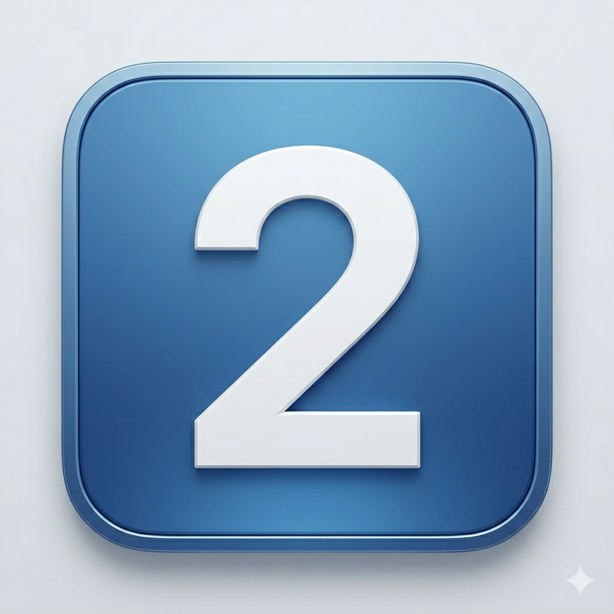
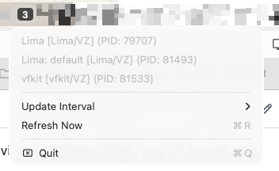

<div align="center">
  

  # VM Monitor

  A lightweight macOS menu bar app that monitors running virtual machines (QEMU and VZ-based) and displays their count and details.

  [](LICENSE)
  [](https://github.com/e-minguez/macos-vms-menu-bar/releases)
  [](https://github.com/e-minguez/macos-vms-menu-bar/releases)
  [](https://github.com/e-minguez/macos-vms-menu-bar/releases/latest)
</div>

---

> ⚠️ **Disclaimer**: This app was vibecoded with AI assistance. I have no idea about the consequences of using it. Use at your own risk!



## Features

- **Custom Menu Bar Icon**: Number displayed in a styled box that adapts to light/dark mode
  - Light mode: Dark box with white text
  - Dark mode: White box with dark text
- **VM Details**: Click to see:
  - VM name
  - VM type (QEMU, Lima/VZ, vfkit/VZ)
  - Process ID (PID)
- **Configurable Update Interval**: Choose from:
  - 1 second
  - 5 seconds (default)
  - 10 seconds
  - 30 seconds
  - 1 minute
- **Manual refresh**: Click "Refresh Now" in the menu
- **Lightweight**: ~0% CPU at idle, minimal memory footprint

## Requirements

- macOS 13.0 or later (arm64 only)
- Xcode Command Line Tools (for Swift compiler) — only needed if building from source

## Installation

Download the latest release from the [Releases page](https://github.com/e-minguez/macos-vms-menu-bar/releases).

1. Download `VMMenuBar-<version>-arm64.zip` and unzip it
2. Move `VMMenuBar.app` to `/Applications`
3. Open it:
   ```bash
   open /Applications/VMMenuBar.app
   ```

### macOS security warning

Because the app is not notarized, macOS will block it on first launch. To allow it:

**Option A — right-click workaround:**
Right-click `VMMenuBar.app` → Open → Open (in the dialog)

**Option B — remove the quarantine flag:**
```bash
xattr -d com.apple.quarantine /Applications/VMMenuBar.app
```

## Building from source

1. Make the build script executable:
   ```bash
   chmod +x build.sh
   ```

2. Run the build script:
   ```bash
   ./build.sh
   ```

3. The app will be created in `build/VMMenuBar.app`

## Running from source

### Option 1: Run directly
```bash
open build/VMMenuBar.app
```

### Option 2: Install to Applications
```bash
cp -r build/VMMenuBar.app /Applications/
open /Applications/VMMenuBar.app
```

## Usage

1. Launch the app - it will appear in your menu bar as a number
2. The number indicates how many VMs are currently running
3. Click the number to see detailed information about each VM
4. Use the "Refresh" option to manually update the list
5. Use "Quit" to close the application

## How It Works

The app runs the following command every 5 seconds to detect running VMs:
```bash
ps auxww | grep -iE 'qemu|vz' | grep -v grep
```

It then parses the output to extract:
- Process details (CPU, memory, PID)
- VM type (QEMU or VZ)
- VM name (extracted from command arguments when possible)

## Customization

### Update Interval
You can change the update interval directly from the menu:
1. Click the VM count icon in the menu bar
2. Select "Update Interval"
3. Choose your preferred interval (1s, 5s, 10s, 30s, or 1 minute)

Your preference is saved automatically.

### Adding More VM Types
To detect additional VM types, edit the grep pattern in `getRunningVMs()`:
```swift
task.arguments = ["-c", "ps axo pid,command | grep -E 'qemu-system|limactl hostagent|vfkit|YOUR_VM_PROCESS' | grep -v grep"]
```

Then add detection logic in `identifyVM()` function.

## License

Licensed under the Apache License, Version 2.0. See [LICENSE](LICENSE) for the full license text.

Copyright 2026 VM Menu Bar Contributors
